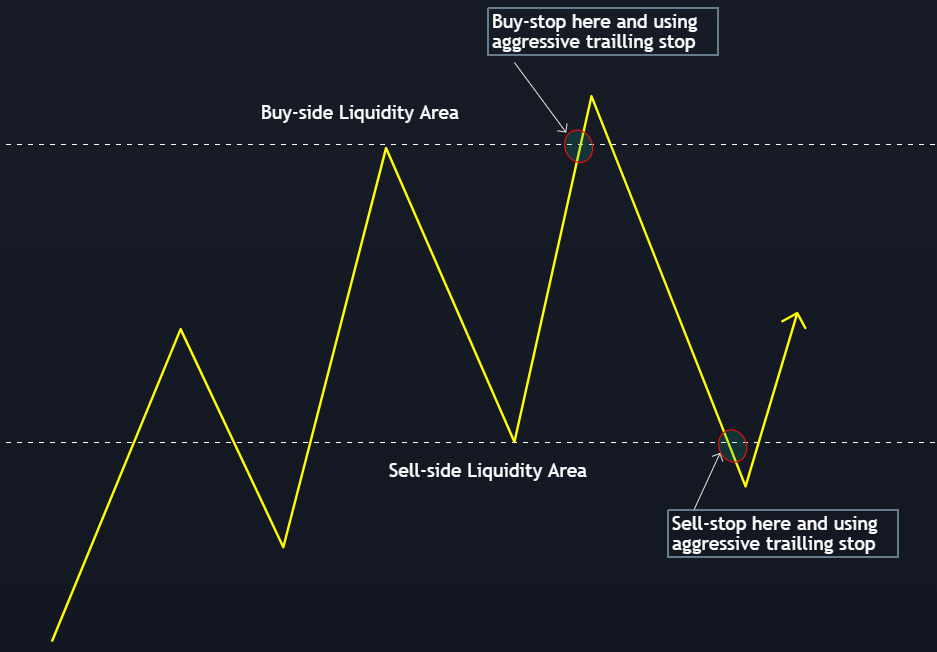
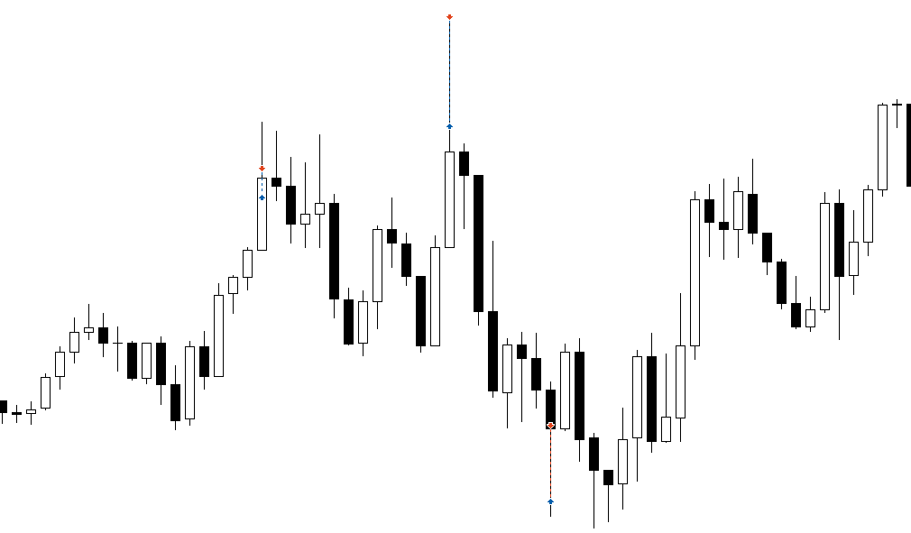
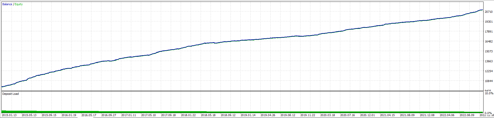
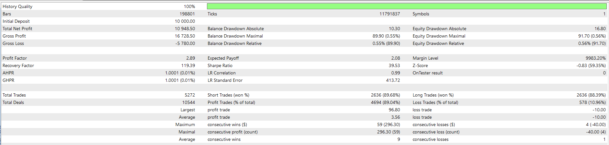

# Scalper Trading Strategy
**This strategy is risky. The average TP is quite low. The real life results will highly dependant to the trading costs. To maximize the profit potential, only use this strategy on a low commission, low spread, and low slippage broker, otherwise, the trading cost will eat up the profits.**

## Concept
At every swing point, a liquidity zone is built-up. Liquidity is any pending stop order placed at any price. If an upward price move hit a buy-stop order (**buy-side liquidity grab**), the stop order execution will move the price up further (breakout). Sometimes, the breakout will continue to move in the same direction further, or quickly fading. 
At a swing point, there are tendencies of buy-stop order placed by a large number of market participant at relatively close price distance from one to another. Even though this is not always the case, we could utilize this liquidity into a scalping strategy. 
By placing a stop order at the exact swing point, any liquidity grab will put our trade into a floating profit condition, and by using a tight trailling-stop loss, we can lock-in our profit very quickly.
Likewise but the opposite in a downtrend.

## Rules for Entry
* __Long__
1. Find a high swing point. A high swing point is characterized as a high of a candle surrounded by a number of lower high of another candles. The minimum number of candle to make the high swing point is optimizable.
2. Check the time. If the time is in the low-spread period, place a buy-stop order at the exact high swing point. 
3. If the stop order is executed, and the trade is already profit by X point, move the stop-loss just several points (Y) below the current bid price. 
4. If the trade is run futher into more profit, keep moving the trailling stop-loss Y points just below the current bid price.
5. The tralling stop movement is calculated in tick-by-tick basis.
* __Short__
1. Find a low swing point. A low swing point is characterized as a low of a candle surrounded by a number of higher low of another candles. The minimum number of candle to make the low swing point is optimizable.
2. Check the time. If the time is in the low-spread period, place a sell-stop order at the exact low swing point. 
3. If the stop order is executed, and the trade is already profit by X point, move the stop-loss just several points (Y) above the current ask price. 
4. If the trade is run futher into more profit, keep moving the trailling stop-loss Y points just above the current ask price.
5. The tralling stop movement is calculated in tick-by-tick basis.

Each pending order is only live for Z hours before deleted/expired. If there is already a pending order or a trade still running, any subsequent signal to the same direction is ignored.

## Example

## Test & Results 
### EURUSD Benchmark
EURUSD D1, 2013-01-01 until 2023-04-29, 10000 USD initial balance, 0.1 lot/trade. Risking 100 points of SL and taking 260 point of TP. Commission is 4 USD per lot total round trip.
The set file used in the test is included.

* Net profit: 10948.5 USD. Which means 10948.5 pips of profit if using 0.1 lot/trade.
* Profit trades: 89.04%
* Total trades: 5272
* Profit factor: 2.89
* Sharpe ratio: 39.5
* Max. consecutive losses: 4x
* Max. consecutive wins: 59x

