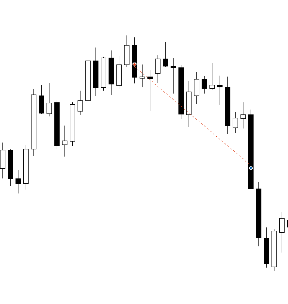
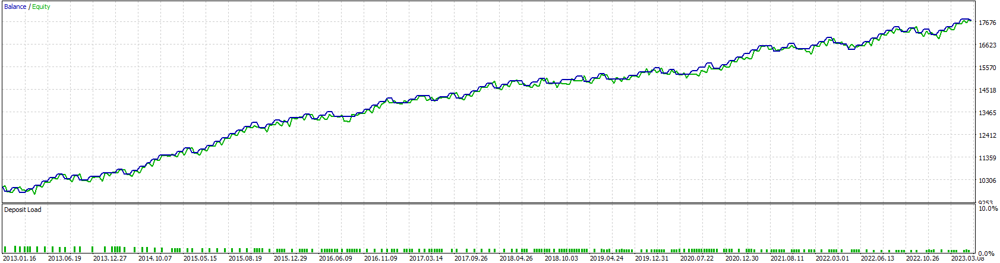
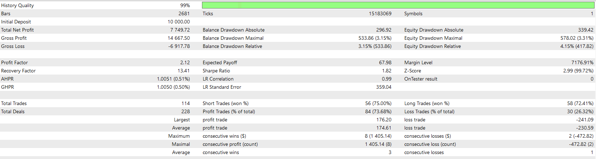

# Smash Day Trading Strategy
A modified version of larry William's Smash Day trading strategy. Working on Daily timeframe (D1).

## Concept
In an uptrend, a sell-stop pending order is placed just bellow yesterday's low. The premise is, if the uptrend is already happened for a long enough time, breaking yesterday's low often become a sign of exhausted trend. Therefore, a trend reversal is likely to come not long afterwards. Likewise but the opposite in a downtrend.

## Rules for Entry
All of the calculations are executed at today's candle open. The calculations ignore today's candle. Only looking from yesterday's candle and backward.
* __Long__
1. Yesterday's candle close must be lower than previous candle low.
2. Yesterday's low must be the lowest price in the last X days. X is a variable to be optimized.
3. Place a buy-stop order at the yesterday's high. This pending order must be executed in the next 48 hours. If not executed, delete it.
* __Short__
1. Yesterday's candle close must be higher than previous candle high.
2. Yesterday's high must be the highest price in the last X days. X is a variable to be optimized.
3. Place a sell-stop order at the yesterday's low. This pending order must be executed in the next 48 hours. If not executed, delete it.

If there is a trade still running, any subsequent signal to the same direction is ignored.

## Filter
X number of days (lookback) in the point 2 above become the entry filter. The premise is, after X number of days, any break of previous day's structure (high or low) to the opposite direction of the trend, become the sign of a trend exhaustion and likely to be followed by a trend reversal. Thus, we catch the next trend quite early.

## Input Parameters
* __Magic__ : EA's magic number
* __Lots__ : Lot opened on each trade.
* __Timeframe__ : Timeframe of execution. D1 = default
* __lookback__ : number of days to look back. (Filter)
* __atrPeriod__ : ATR Period to calculate ATR-base stop loss distance.
* __atrMult__ : --> SL distance = ATR * atrMult.
* __slMode__ : SLMODE_ATR means the stop loss is calculated based on ATR. SLMODE_FIXED means the stop loss is a fixed value.
* __slPoint__ : SL distance is points. Used when SLMODE_FIXED is selected.
* __tpFactor__ : --> TP distance = SL distance * tpFactor. Used in either ATR and fixed SL.
* __pendingDistance__ : buffer distance in points away from the high/low or close price whichever farthest from the close price. Used to avoid false confirmation.
* __ExpirationHours__ : pending order expiration in hours.

## Test & Results
EURUSD D1, 2013-01-01 until 2023-04-29, 10000 USD initial balance, 0.1 lot/trade. Risking 2350 points and 0.75 TP factor.
* Net profit: 7749.72. Which means 7749.72 pips profit. (test is using 0.1 lot/trade)
* Profit trades: 73.68%
* Total trades: 114
* Profit factor: 2.12
* Sharpe ratio: 1.82
* Max. consecutive loss: 2x
* Max. consecutive profit: 8x

