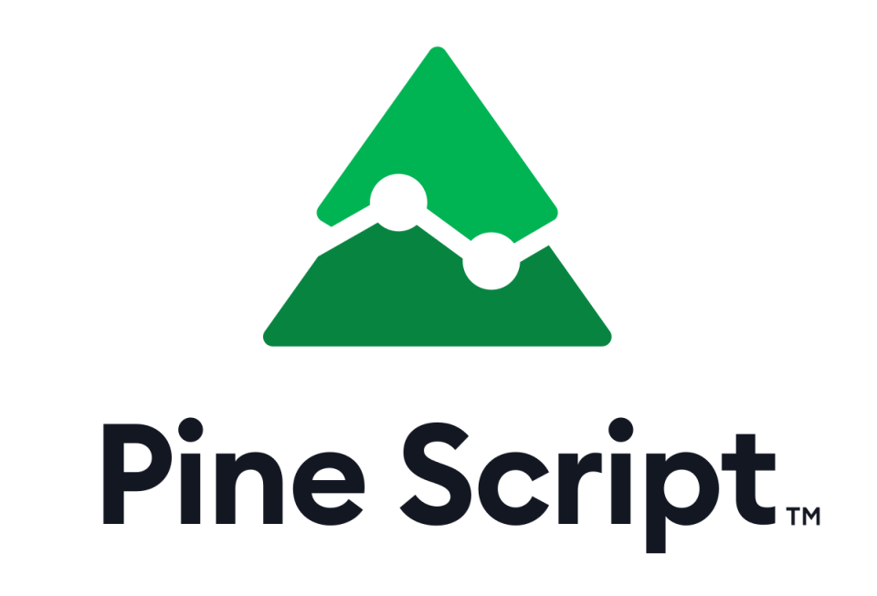
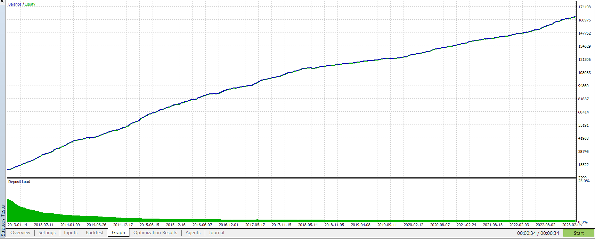

# Trading Strategy Collections - Public
My collections of several trading strategies I've made for anyone to use. Written in MQL5 and PineScript programming langguage.

# Index
## Price Action and Chart Pattern
1. __Smash Day (MQL5)__ ([__page__](https://handiko.github.io/TradingStrategy-Public/Price%20Action%20and%20Chart%20Pattern/Smash%20Day) | [__repo__](https://github.com/handiko/TradingStrategy-Public/tree/main/Price%20Action%20and%20Chart%20Pattern/Smash%20Day))
2. __Scalper (MQL5)__ ([__page__](https://handiko.github.io/TradingStrategy-Public/Price%20Action%20and%20Chart%20Pattern/Scalper/) | [__repo__](https://github.com/handiko/TradingStrategy-Public/tree/main/Price%20Action%20and%20Chart%20Pattern/Scalper))

## Indicator Based
1. __Reverse RSI (Pine Script)__ ([__page__](https://handiko.github.io/Reverse-RSI-Forex-Strategy/) | [__repo__](https://github.com/handiko/Reverse-RSI-Forex-Strategy))

_still in progress.._

